# Schema.org Blocks

A WordPress plugin that extends all blocks with schema.org type mapping and structured data output.

[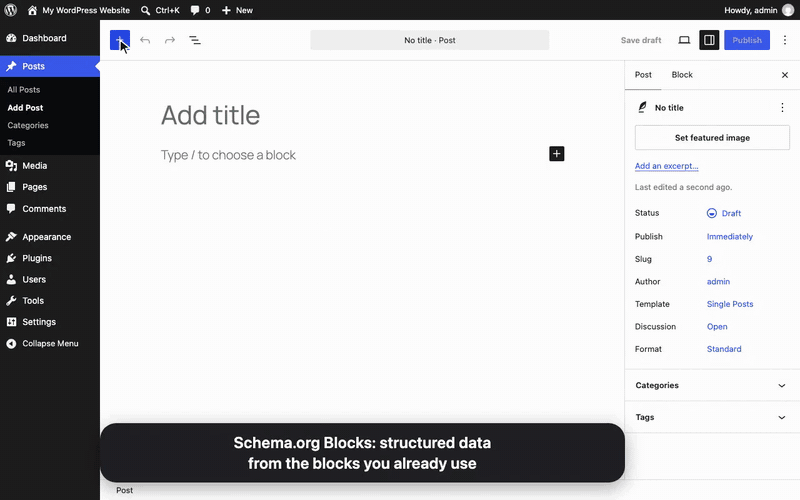](docs/media/demo.mp4)

[Watch the full demo (MP4, about 1.5 min).](docs/media/demo.mp4)

<a href="https://playground.wordpress.net/?blueprint-url=https://raw.githubusercontent.com/humanmade/hm-schema-block/main/playground-blueprint.json"></a>

## Features

- 🎯 **Universal Block Extension**: Adds schema.org mapping to all WordPress blocks
- 🔗 **Nearest Typed Ancestor**: Property blocks attach to the closest typed block above them, through untyped groups, columns and template parts
- 🧱 **Block Theme Support**: Post title, date, author, featured image, excerpt and terms, site title, tagline and logo, and query loops all feed the graph
- 🍞 **Breadcrumbs**: The core Breadcrumbs block outputs a `BreadcrumbList` with no setup, linked from the page node as its `breadcrumb`
- 🪪 **Linked Graph**: Site-wide entities get an `@id`, and other entities can point to them, for example an Article's publisher
- ❓ **Quick Setup Presets**: FAQ and How-to variations of the Accordion block, plus Quick setup buttons on Group, Accordion and Query blocks
- 🧩 **Block Patterns**: Seven ready-made patterns in a "Schema.org" category
- 🎨 **Smart Defaults**: Automatic mapping for common blocks (image, button, heading, paragraph, accordion, details, post and site blocks)
- 🌳 **Hierarchical Types**: Support for nested schema types (e.g., Place > Accommodation > Room)
- 🔄 **Flexible Property Mapping**: Map block attributes, block text, inner blocks text, post fields or site fields to schema properties
- ✅ **Required Properties**: An Article without an author, publisher or date gets them from its post, and a pre-publish check in the editor flags other required structured data that is missing, such as a question with no answer. Publishing is never blocked
- 🚀 **Yoast SEO Integration**: Extends Yoast's schema output when available
- 📊 **JSON-LD Fallback**: Automatic JSON-LD output when Yoast is not installed

## Screenshots

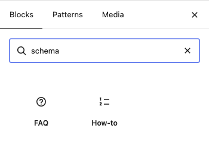

Search the inserter for "schema" to find the FAQ and How-to blocks.

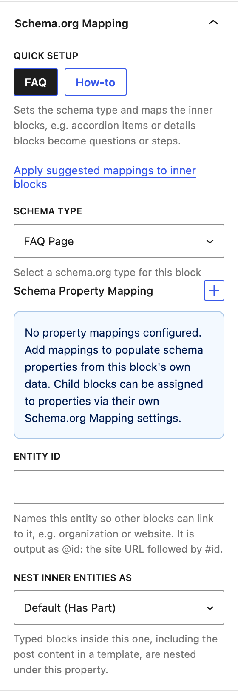

The FAQ block comes set up as an FAQPage.

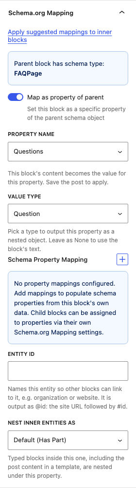

Each accordion item is a Question, and its panel is the answer.

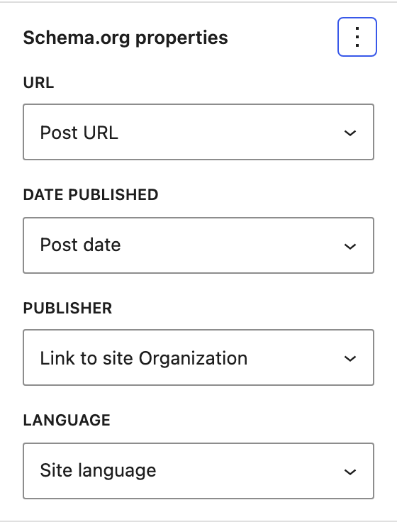

Each property of a typed block gets a Source: a block attribute, block text, a post or site field, or a link to another entity.

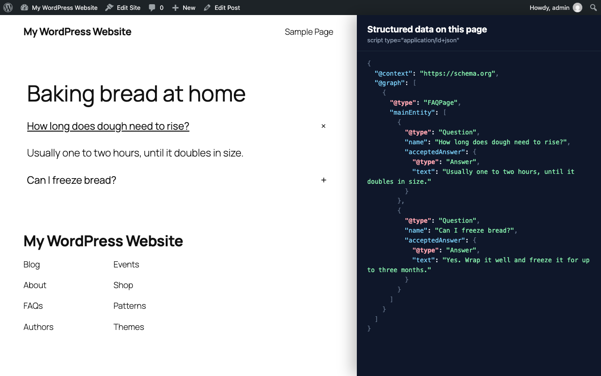

The published post with its FAQPage structured data (JSON-LD shown in a demo side panel).

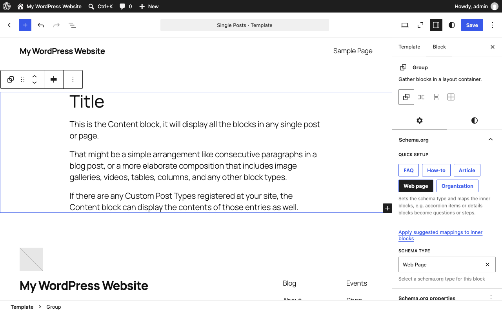

In the site editor, the Web page Quick setup types the main group of a template.

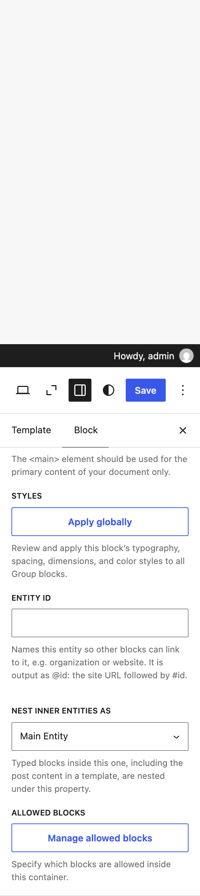

The graph settings give an entity an ID and choose how it nests the entities inside it.

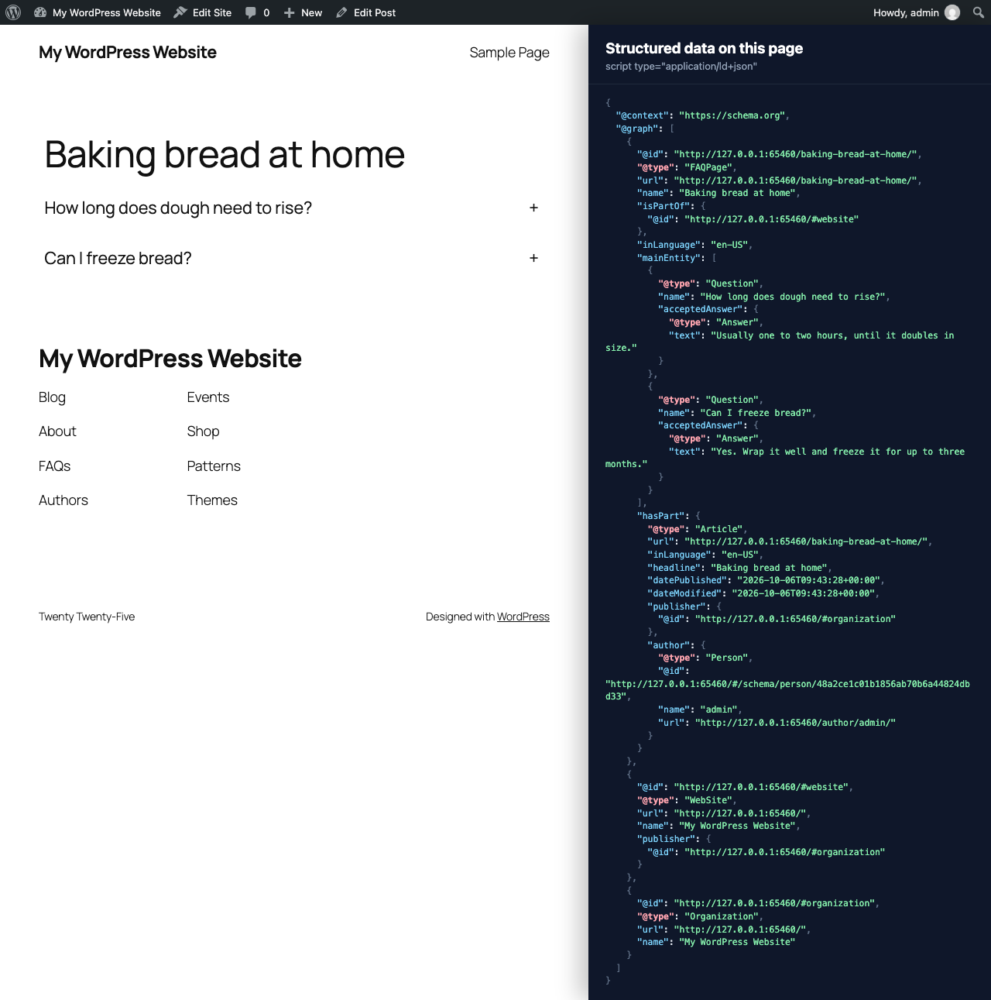

With a typed template, the page is one node, here the FAQPage with its questions as `mainEntity` and the Article as `hasPart`, linked to the WebSite and Organization nodes (JSON-LD shown in a demo side panel).

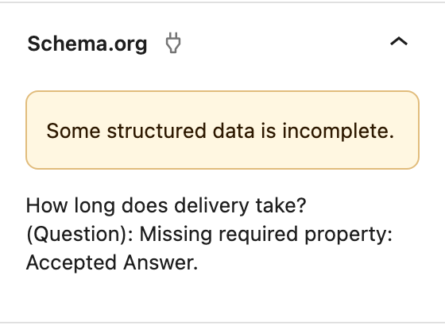

Before publishing, the Schema.org panel lists required structured data that is missing, such as a question with no answer. It never blocks publishing.

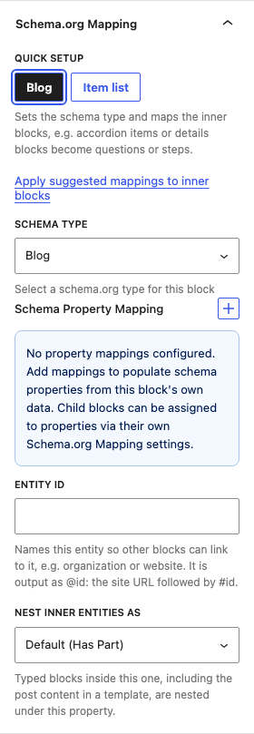

Query Loop blocks offer Blog and Item list presets.

## Installation

1. Clone this repository to your WordPress plugins directory:
```bash
cd wp-content/plugins
git clone https://github.com/humanmade/hm-schema-block.git
cd hm-schema-block
```

2. Install dependencies:
```bash
npm install
composer install
```

3. Build the plugin:
```bash
npm run build
```

4. Activate the plugin in WordPress admin.

## Development

### Local Development with WordPress Playground

Start the development environment:
```bash
npm run playground:start
```

Start the build watcher:
```bash
npm start
```

Access your development site at http://127.0.0.1:9400. You are logged in as `admin` (password `password`) and the plugin is already active.

### Testing

Run Playwright e2e tests:
```bash
npm run test:e2e
```

The tests start their own Playground instance on a free port the system picks, so any number of runs can go at once, in one checkout or many. Each run saves its own login under `artifacts/storage-states/`. Give parallel runs in the same checkout their own `--output` folder, because Playwright clears it at the start of a run. Set `WP_PLAYGROUND_PORT` to pick the port, or `WP_BASE_URL` to use a server you already started.

Watch mode for tests:
```bash
npm run test:e2e:watch
```

### Code Quality

Lint JavaScript:
```bash
npm run lint:js
```

Format JavaScript:
```bash
npm run format
```

## Usage

### Basic Schema Type Mapping

1. Edit any post or page in the block editor
2. Select a block (e.g., a Group block)
3. In the block inspector, open the "Schema.org" panel
4. Select a schema type (e.g., "Article", "Organization", "Place")
5. In the "Schema.org properties" panel that appears, use its menu to add a property and pick a source for it

Each property has a source:

- **Block attribute**: a block attribute. This includes attributes that core blocks store in their markup, such as the image `url` or the details `summary`. With no attribute picked, the block text is used.
- **Block text**: the text of the block, including its inner blocks.
- **Inner blocks text**: the text of the inner blocks only. A details block uses this for its answer, without the summary.
- **Post title**, **Post URL**, **Post date**, **Post modified date**, **Post excerpt**, **Post author** and **Post featured image**: fields of the current post. Inside a query loop, this is the post being shown. Dates are ISO 8601.
- **Site name**, **Site tagline**, **Site URL** and **Site logo**: fields of the site.
- **Link to site Organization**: a link to the site's Organization entity, output as `{"@id": "…"}`. See [Linked entities](#linked-entities).

### FAQ and How-to

Insert the **FAQ** or **How-to** variation of the Accordion block. Both come set up: each accordion item is a Question or a HowToStep, the heading is its name, and the panel is the answer or the step text. The How-to takes its name from the post title.

You can also set up existing blocks. Select an Accordion or Group block and use the **FAQ** or **How-to** button under Quick setup. Details blocks inside an FAQ become Questions: the summary is the question and the inner blocks are the answer. Any typed block with inner blocks has an **Apply suggested mappings to inner blocks** link, which applies the smart defaults again.

### Quick setup

Quick setup gives a block a type and sets up the blocks inside it. Each block offers its own presets:

- **Group**: FAQ, How-to, Article (url from the post) and Organization (id `organization`, url from the site)
- **Accordion**: FAQ and How-to
- **Query Loop**: Blog and Item list

Google shows FAQ rich results only for some sites and no longer shows how-to rich results, but the markup is still valid and other search and answer engines use it.

### Parent and Child Blocks

When a block has a schema type, any block inside it can:

1. **Use as a property**: turn on "Use as a property of …" and pick the property. A typed block is only offered the properties that accept its type, and a single match is picked for you. The block's text becomes the value.
2. **Pick a value type**: a property block can also pick a type from those the property accepts. When only one type fits, it is set for you. It is then output as a nested object, with its own mappings and child properties.
3. **Be its own entity**: leave the toggle off and pick any schema type. The block is output as a separate object.

A property block belongs to its nearest typed ancestor. Untyped containers in between, such as groups, columns, rows and template parts, are passed through. The search stops at:

- a typed block, which is a separate entity
- a property block, whose content is its own value
- an untyped post template, whose content repeats for each post

The child values follow these rules:

- Several children mapped to the same property produce an array, such as the questions of an FAQPage.
- A plain value for a property that only accepts objects is wrapped. For example `acceptedAnswer` text becomes an `Answer` with `text`, and an `author` name becomes a `Person` with `name`.
- An object with no properties is left out of the output.
- A child value replaces a mapping on the parent for the same property.

### Smart Defaults

When you add a block inside a typed parent, it is set up for you:

- **core/heading**: `headline` or `name`
- **core/paragraph**: `description` or `text`
- **core/image**: `image` or `logo`, as an `ImageObject` with `contentUrl` and `caption` when the property accepts one. Several images give an array.
- **core/button**: `url`, from the button link
- **core/accordion-item**: a `Question` for `mainEntity`, or a `HowToStep` for `step`
- **core/accordion-heading**: `name`, from the heading title
- **core/accordion-panel**: `acceptedAnswer` or `text`
- **core/details**: a `Question` or `HowToStep`, with the summary as `name` and the inner blocks as the answer or text
- **core/post-title**: `headline` or `name`
- **core/post-date**: `datePublished`, or `dateModified` for the Modified Date variation
- **core/post-author** and **core/post-author-name**: `author`
- **core/post-featured-image**: `image`
- **core/post-excerpt**: `description`
- **core/post-terms**: `keywords`
- **core/site-title**: `name`
- **core/site-tagline**: `description`
- **core/site-logo**: `logo` or `image`
- **core/post-template**: a `BlogPosting` for `itemListElement` or `blogPost`

The first property the parent type has is used. Headings and paragraphs inside a Question, Answer or HowToStep get no default, since their text already feeds the answer. Most blocks get a default only for the first unconfigured block of that type, and only while no other block under the same typed ancestor claims the property. Images, accordion items and details blocks repeat. If you turn off "Use as a property of …", the block keeps that choice.

### Example: Article with Schema

```
Group (Article)
├── Heading (→ headline property)
├── Paragraph (→ description property)
├── Image (→ image property as ImageObject)
│   ├── URL → contentUrl
│   └── Caption → caption
└── Button (→ url property)
```

### Example: FAQ

```
Accordion (FAQPage)
├── Accordion item (→ mainEntity as Question)
│   ├── Accordion heading (→ name)
│   └── Accordion panel (→ acceptedAnswer)
└── Accordion item (→ mainEntity as Question)
    ├── Accordion heading (→ name)
    └── Accordion panel (→ acceptedAnswer)
```

## Block Themes

Templates and template parts work the same way as post content. The plugin reads them as the page renders, so a graph can come from templates alone.

### Dynamic blocks

Dynamic blocks save no text, so the plugin asks WordPress for their value. Post blocks use the post in their block context. Inside a query loop, that is the post being shown.

| Block | Value | Default property |
|-------|-------|------------------|
| Post Title | Post title | `headline` or `name` |
| Post Date | Publish date, ISO 8601 | `datePublished` |
| Post Date (Modified Date variation) | Modified date, ISO 8601 | `dateModified` |
| Post Author, Post Author Name | Author display name | `author` (as a `Person`) |
| Post Featured Image | Image URL | `image` |
| Post Excerpt | Excerpt text | `description` |
| Post Terms | Term names, comma separated | `keywords` |
| Site Title | Site name | `name` |
| Site Tagline | Site tagline | `description` |
| Site Logo | Logo URL | `logo` or `image` |

### Breadcrumbs

The core Breadcrumbs block (WordPress 7.0 and later) is a `BreadcrumbList` with no setup, and the editor shows "Breadcrumb List" as its type. The plugin renders the block for the post in context and reads its trail: each entry is a `ListItem` with its `position`, its text as `name` and its link as `item`. The last entry has no link in core, so it links to the post's page. With a post in context, the list gets the `@id` of the permalink plus `#breadcrumb`, and the page node's `breadcrumb` points to it. When Yoast SEO outputs its own breadcrumb, ours is left out.

To turn it off, set the block's Schema Type to none.

### Query loops

Give a Post Template block a type, and it outputs one entity per post in the query. Each one gets the post's permalink as `url`. The query comes from the Query Loop block, or from the main query when the loop inherits it.

- A typed Post Template on its own gives one `BlogPosting` (or other type) per post.
- On a `Blog` query, mark the Post Template as the `blogPost` property. The posts become `blogPost` entries of the Blog.
- On an `ItemList` query, mark it as `itemListElement`. Each post is wrapped in a `ListItem` with its `position`.

### Linked entities

A typed block can have an `id`. It is output as `@id`, made from the home URL and `#id`, for example `https://example.com/#organization`. The Organization preset sets the id `organization`. This is the same `@id` that Yoast SEO gives the site organization, so both nodes describe one organization.

Another entity links to it with a `reference` mapping, or **Link to site Organization** in the Source picker. The Article header pattern uses this for `publisher`. With the Organization in the header template part and the Article header in the single template, a post with no schema of its own outputs:

```json
{
  "@context": "https://schema.org",
  "@graph": [
    {
      "@id": "https://example.com/#organization",
      "@type": "Organization",
      "url": "https://example.com/",
      "logo": "https://example.com/wp-content/uploads/logo.png",
      "name": "Example",
      "description": "Just another site"
    },
    {
      "@type": "Article",
      "url": "https://example.com/hello-world/",
      "publisher": { "@id": "https://example.com/#organization" },
      "keywords": "News",
      "headline": "Hello world",
      "author": { "@type": "Person", "name": "Jane Doe" },
      "datePublished": "2026-09-30T10:00:00+00:00",
      "image": "https://example.com/wp-content/uploads/hello.jpg"
    }
  ]
}
```

### Page graph

Template entities contain the entities on the page. An entity inside another entity's blocks is nested under the outer one's `contains` property, `hasPart` by default for creative works. `core/post-content` resolves to the post's blocks, so a typed group around post content in the single template contains the FAQ or how-to in each post. Set `"contains": ""` on a block to keep inner entities as separate nodes.

The "Web page" Quick setup on a group types it `WebPage` with `@id` and `url` from the permalink (the same `@id` Yoast gives its WebPage), `name` from the post title, `isPartOf` the site, and `contains: mainEntity`. Use it on the template's main group, with an `Article` group inside around the post title and post content.

A page is one node. A page subtype such as `FAQPage` is not a part of the WebPage, it is the WebPage, so the plugin merges an FAQ in the post into the page node, whether the template types a WebPage or not. With the template above and an FAQ in the post:

```json
{ "@type": "FAQPage", "@id": "https://example.com/bread/", "isPartOf": { "@id": "https://example.com/#website" },
  "mainEntity": [ { "@type": "Question", … } ],
  "hasPart": { "@type": "Article", "headline": "Bread" } }
```

The page's `mainEntity` keeps only what its type accepts (an FAQPage takes Questions); other entities move to `hasPart`. Without a typed template the plugin adds the WebPage node itself (`@id` and `url` from the permalink, `name` from the post title, `isPartOf` the site, `inLanguage` from the site language). When the post has one other entity, such as an Article, the page's `mainEntity` points to it and it gets `mainEntityOfPage`. With several, they stay separate. Nothing is added to a post that outputs no schema.

When the graph refers to `#website` or `#organization` and no block defines them, the plugin adds WebSite and Organization nodes built from the site settings. With Yoast SEO active it leaves that to Yoast.

An entity nested more than once, such as the same author on every post in a list, is output once as a top-level node and referenced by `{"@id": …}` everywhere else. Author blocks give a Person with the `@id` Yoast uses for the same user (`#/schema/person/<hash>`) and the author archive as `url`. Values are not copied down from outer entities to nested ones: schema.org and search engines don't infer them, so shared things are linked by `@id` instead, and the page language is mapped explicitly (`inLanguage` from the site language on the Web page and Article presets).

Typed blocks show these in the Advanced panel of the inspector, in the post editor and the site editor: **Entity ID** names the entity for `@id` links, and **Nest inner entities as** picks the default, none, or any property that takes entities. A mapping's Source can link to the site Organization, the site Web site, or any Entity ID.

### Patterns

The plugin adds a **Schema.org** block pattern category with seven patterns:

- **FAQ accordion**: questions and answers in an accordion, as `FAQPage`
- **How-to accordion**: steps in an accordion, as `HowTo` named after the post
- **FAQ details**: questions and answers in details blocks, as `FAQPage`
- **Article header**: post terms, title, author, date and featured image, as an `Article` published by the site Organization. Offered for single templates.
- **Site header with Organization**: site logo, title and tagline, as the `Organization` with id `organization`. Offered for header template parts.
- **Blog post list**: a query loop as a `Blog`, with a `BlogPosting` per post
- **Post item list**: a query loop as an `ItemList`, with a `ListItem` per post

## Schema Types

The plugin includes comprehensive schema.org type definitions including:

- **Creative Works**: Article, BlogPosting, NewsArticle, CreativeWork, WebPage, Comment
- **FAQs and How-tos**: FAQPage, Question, Answer, HowTo, HowToStep
- **Sites and Lists**: WebSite, Blog, ItemList, ListItem
- **Organizations**: Organization, LocalBusiness
- **People**: Person
- **Places**: Place, Accommodation, Room
- **Products**: Product
- **Events**: Event
- **Media**: ImageObject, MediaObject
- **Structured Values**: PostalAddress, GeoCoordinates, Offer, Review, Rating

All types support inheritance, so properties from parent types are automatically available.

## Extending the Plugin

### Adding Custom Schema Types

Use the `schema_org_blocks_types` filter:

```php
add_filter( 'schema_org_blocks_types', function( $types ) {
    $types['CustomType'] = [
        'label' => 'Custom Type',
        'parent' => 'Thing',
        'properties' => [
            'customProperty' => [
                'type' => 'Text',
                'label' => 'Custom Property'
            ],
        ],
    ];
    return $types;
} );
```

### Modifying Smart Defaults

Smart defaults are a rule table (`RULES`) in `src/utils/smart-defaults.js`, keyed by block name. Each rule lists candidate parent `properties` in order of preference, or a function of the block's attributes that returns them. It can also set `repeatable`, `exceptParentTypes`, `nested` (the block is an entity of its own, so its inner blocks are not properties of the outer type), and a `build` function that returns the `schemaOrg` value. Add a rule to support another block type. Quick setup presets are in `PRESETS` in the same file. Each one lists the `blocks` that offer it.

### Changing the Output

Use the `schema_org_blocks_graph` filter to change the final list of schema objects:

```php
add_filter( 'schema_org_blocks_graph', function( $graph ) {
    $graph[] = [
        '@type' => 'Organization',
        'name'  => 'Example Ltd',
        'url'   => 'https://example.com',
    ];
    return $graph;
} );
```

### For AI agents

The plugin ships an agent skill in [`skills/schema-org-blocks/SKILL.md`](skills/schema-org-blocks/SKILL.md). It explains the `schemaOrg` attribute, how the graph is built, which pattern to copy for each goal, and how to check the output. Copy the folder into a project's `.claude/skills/`, or point any agent that reads `SKILL.md` files at it. It helps an agent add structured data to patterns and block theme templates without breaking the block markup.

## Output

Schema is collected from the blocks of the current page. Block themes render their templates before `wp_head`, so the plugin collects each typed block as it renders. Classic themes render content after `wp_head`, so on single posts and pages the plugin reads the queried post's blocks instead.

### With Yoast SEO

When Yoast SEO is active, the schema objects are added to Yoast's graph using the `wpseo_schema_graph` filter. On singular pages, page subtypes such as FAQPage are merged into Yoast's WebPage node, which then has the types `["WebPage", "FAQPage"]`, as Yoast's own FAQ block outputs.

### Without Yoast SEO

Schema data is output as JSON-LD in the site header. The characters `<`, `>` and `&` are hex-escaped, so a mapped value cannot close the script tag.

```html
<script type="application/ld+json">
{
  "@context": "https://schema.org",
  "@graph": [
    {
      "@type": "Article",
      "headline": "My Article Title",
      "description": "Article summary...",
      "image": {
        "@type": "ImageObject",
        "contentUrl": "https://example.com/image.jpg",
        "caption": "Image caption"
      }
    }
  ]
}
</script>
```

## Known Limitations

Schema is built from the saved block markup, plus WordPress data for the dynamic blocks above, not from the final rendered HTML. This keeps output fast and the same in block and classic themes, but it has some effects:

- Pattern overrides and block bindings are not applied. A synced pattern with overridden text gives the pattern's own text, and a block bound to post meta gives its saved fallback.
- Plugins that hide content with `pre_render_block`, `render_block_data` or `the_content`, such as membership or paywall plugins, do not hide it from the schema. Do not map members-only content to schema properties. You can remove it with the `schema_org_blocks_graph` filter.
- Dynamic blocks other than those listed in [Dynamic blocks](#dynamic-blocks) save no text, so they give no value.

Blocks hidden with the block visibility setting, and password-protected posts and synced patterns, are left out.

## Requirements

- WordPress 6.9+ (tested up to 7.1)
- PHP 8.0+ (tested up to 8.5)
- Node.js 22.22+ or 24.15+ (for development)

## License

GPL-2.0-or-later

## Credits

Built with ❤️ by [Human Made](https://humanmade.com)
